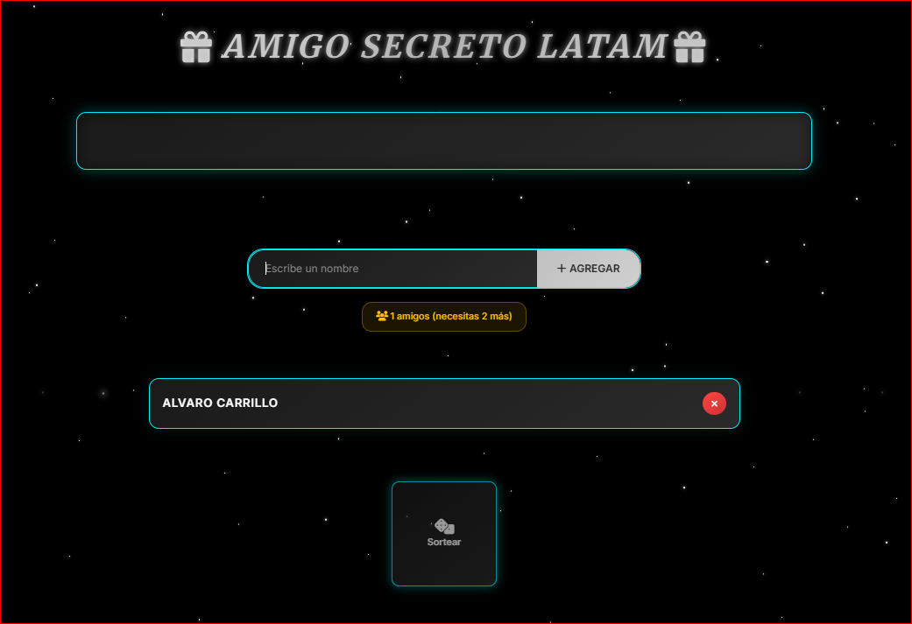

# Amigo Secreto reto ALURA LATAM

Hola, que tal !!! este es un proyecto para hacer el sorteo del amigo secreto. Lo hice para practicar y que se vea cool, espero que les guste.

## Qué hace este proyecto?

*   Puedes poner nombres en una lista de todos los jugadores.
*   Hay un botón para sortear y te dice a quién le tienes que dar regalo. Es genial.
*   No deja que te saques a ti mismo, eso está arreglado.
*   Se ve con luces de neón y fondo oscuro.
*   Si cierras la página, los nombres se quedan guardados por un día.
*   Funciona en compu y en cel.

### Como se usa

1.  **Pones los nombres**: Escribes un nombre y le das a "Agregar".
    

2.  **Sorteas**: Cuando ya hay 3 personas o más, el cubo para sortear se prende. Le das clic y ya.
    

## Cómo instalarlo

Para que te corra en tu compu.

### Qué necesitas

*   Tener Node.js. Si no lo tienes, búscalo en google y lo instalas.
    Para ver si lo tienes, pon en la terminal: `node -v`

### Pasos

1.  **Bájate el código**:
    ```bash
    git clone https://github.com/mariangeldante2563/Proyecto-LATAM-AMIGO-SECRETO.git
    ```

2.  **Métete a la carpeta**:
    ```bash
    cd Proyecto-LATAM-AMIGO-SECRETO
    ```

### Dependencias

No necesita casi nada. Solo `live-server` para que corra fácil, pero no hay que instalarlo aparte.

### Para correr el proyecto

En la terminal, dentro de la carpeta, pones esto:

```bash
npx live-server
```

Y ya. Se abre solo en el navegador y si cambias algo del código, se actualiza solo.

## Si algo falla

*   **Si `npx live-server` no jala**: chance no tienes node. O revisa el internet.
*   **Si no se ven los cambios**: refresca la página con `Ctrl + Shift + R`. O para y corre el `live-server` otra vez.
*   **Si se borran los nombres**: es normal, se borran después de 24 horas. Si no te gusta, cambia `dayInMs` en `app.js`.

---
Hecho por mariangeldante2563.